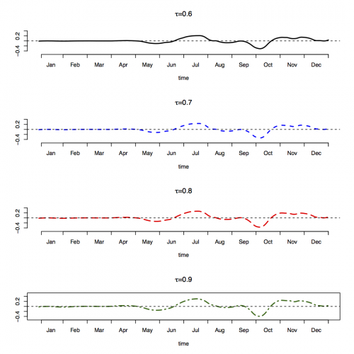
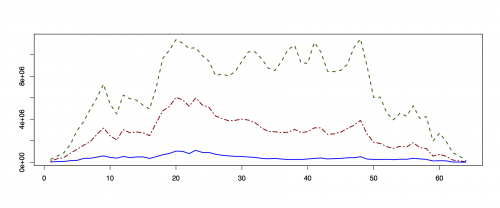

[](http://quantlet.de/index.php?p=info)

## [](http://quantlet.de/) **P_beta_est** [](http://quantlet.de/d3/ia)

```yaml

Name of Quantlet : P_beta_est

Published in : 'P. Burdejova, W.K. Härdle, P.Kokoszka and Q.Xiong (2015): Change point and trend
analyses of annual expectile curves of tropical storms'

Description : 'Plots the squared norms of normalized differences of mean functions for expectile
curves of hurricanes for differentlevels of tau. Plots the norm of estimated slope functions beta
of hurricane data and plots the estimated beta functions.'

Keywords : squared norm, curve, expectile, time varying, slope, beta, hurricane, DYTEC

See also : data_load_hurricanes.R

Author : Burdejova Petra

Datafile : Hurricanes.csv

Example : 'Plots of squared norm of estimated slope beta functions. Plots estimated beta functions
for upper expectiles. Plots P differences for tau = 0.1, 0.5 and 0.9.'

```






### R Code:
```r
rm(list = ls(all = TRUE))
graphics.off()

## install and load packages
libraries = c(“fda”, “fda.usc”, “expectreg”)
lapply(libraries, function(x) if (!(x %in% installed.packages())) {
    install.packages(x)
})
lapply(libraries, library, quietly = TRUE, character.only = TRUE)

# Set working directory
# setwd("")  

#source(“Data_load_hurricanes.R”)

#compute squared norm
mu_hat          = vector(mode = "list", length = 64)
mu_tilda        = vector(mode = "list", length = 64)
P_mtx           = vector(mode = "list", length = 64)
P2_mtx          = vector(mode = "list", length = 64)
P_int           = vector(mode = "list", length = 64)
P_int_as_matrix = matrix(nrow = 64, ncol = 9)

for (k in 1:64) {
    mu_hat_k   = mat.or.vec(nr = 1460, nc = 9)
    mu_tilda_k = mat.or.vec(nr = 1460, nc = 9)
    for (i in 1:k) {
        mu_hat_k = mu_hat_k + expect_list[[i]]
    }
    mu_hat[[k]] = mu_hat_k/k
    for (i in (k + 1):65) {
        mu_tilda_k = mu_tilda_k + expect_list[[i]]
    }
    mu_tilda[[k]] = mu_tilda_k/(65 - k)
    P_mtx[[k]]    = (mu_hat[[k]] - mu_tilda[[k]]) * (k * (65 - k)/65)
    P2_mtx[[k]]   = P_mtx[[k]] * P_mtx[[k]]
    P2_mtx_k      = P2_mtx[[k]]
    preint        = rep(0, 9)
    for (t in 2:1460) {
        preint = preint + ((P2_mtx_k[t - 1, ] + P2_mtx_k[t, ])/2)
    }
    P_int[[k]]           = preint
    P_int_as_matrix[k, ] = preint
}  #end of k loop

# plot the squared norm P
plot_path = paste0(mainDir, "/P_differences.pdf")
pdf(plot_path, width = 12, height = 5)
plot(P_int_as_matrix[, 9], type = "l", lty = 2, lwd = 2, col = "darkgreen", xlab = "", 
    ylab = "", main = "")
lines(P_int_as_matrix[, 9], lty = 2, lwd = 2, col = "darkgreen")
lines(P_int_as_matrix[, 5], lty = 6, lwd = 2, col = "darkred")
lines(P_int_as_matrix[, 1], lty = 1, lwd = 2, col = "blue")
box()
dev.off()

# compute all beta functions
expect_list_tau = vector(mode = "list", length = 9)
exp_tau_mtx = matrix(nrow = 65, ncol = 1460)
for (tau in 1:9) {
    expect_list_tau[[tau]] = exp_tau_mtx
}

for (tau in 1:9) {
    for (year in 1:65) {
        expect_list_tau[[tau]][year, ] = expect_list[[year]][, tau]
    }
}

beta_mtx = matrix(nrow = 1460, ncol = 9)

for (tau in 1:9) {
    cat("tau", tau, "n")
    brbr_mtx  = t(expect_list_tau[[tau]])
    beta      = numeric(1460)
    alpha     = numeric(1460)
    residuals = matrix(nrow = 65, ncol = 1460)
    for (t in 1:1460) {
        beta_fun = 0
        Xn       = brbr_mtx[t, ] + beta_fun
        b_presum = 0
        a_presum = 0
        for (k in 1:65) {
            b_coef   = (2 * k) - 65 - 1
            b_presum = b_presum + (b_coef * Xn[k])
            a_coef   = (2 * 65) + 1 - (3 * k)
            a_presum = a_presum + (a_coef * Xn[k])
        }
        beta[t]         = b_presum * 6/(65 * 66 * 64)
        alpha[t]        = a_presum * 2/(65 * 64)
        beta_mtx[, tau] = beta
    }  # end of t cycle
}

basis = create.bspline.basis(c(0, 1), nbasis = 365, norder = 4)

# plot beta hat hunctions
plot_path = paste0(mainDir, "/beta_hat.pdf")
pdf(plot_path)
par(mfrow = c(4, 1))
# tau=6
beta_fun = Data2fd(argvals = seq(0, 1, length = 1460), y = beta_mtx[, 6], basisobj = basis)
plot(beta_fun, lty = 1, lwd = 2, , axes = FALSE, ylim = c(-0.5, 0.5), xlab = "time", 
    ylab = " ", main = expression(paste(tau, "=0.6")))
axis(side = 1, at = c(1/120, 120/120), labels = c("", ""))
axis(side = 1, at = c(1:12) * 120/120/12, labels = c(" ", " ", " ", " ", " ", " ", 
    " ", " ", " ", " ", " ", " "))
month_labels = c("Jan", "Feb", "Mar", "Apr", "May", "Jun", "Jul", "Aug", "Sep", "Oct", 
    "Nov", "Dec")
axis(side = 1, at = ((c(1:12) * 120) - 60)/12/120, tick = FALSE, labels = month_labels)
axis(side = 2)  #, at = c(-5:5)/10, cex.axis=1 )

# tau=7
beta_fun = Data2fd(argvals = seq(0, 1, length = 1460), y = beta_mtx[, 7], basisobj = basis)
plot(beta_fun, col = "blue", lty = 2, lwd = 2, , axes = FALSE, ylim = c(-0.5, 0.5), 
    xlab = "time", ylab = " ", main = expression(paste(tau, "=0.7")))
axis(side = 1, at = c(1/120, 120/120), labels = c("", ""))
axis(side = 1, at = c(1:12) * 120/120/12, labels = c(" ", " ", " ", " ", " ", " ", 
    " ", " ", " ", " ", " ", " "))
month_labels = c("Jan", "Feb", "Mar", "Apr", "May", "Jun", "Jul", "Aug", "Sep", "Oct", 
    "Nov", "Dec")
axis(side = 1, at = ((c(1:12) * 120) - 60)/12/120, tick = FALSE, labels = month_labels)
axis(side = 2)  #, at = c(-5:5)/10, cex.axis=1 )\t

# tau=8
beta_fun = Data2fd(argvals = seq(0, 1, length = 1460), y = beta_mtx[, 8], basisobj = basis)
plot(beta_fun, col = "red", lty = 5, lwd = 2, , axes = FALSE, ylim = c(-0.5, 0.5), 
    xlab = "time", ylab = " ", main = expression(paste(tau, "=0.8")))
axis(side = 1, at = c(1/120, 120/120), labels = c("", ""))
axis(side = 1, at = c(1:12) * 120/120/12, labels = c(" ", " ", " ", " ", " ", " ", 
    " ", " ", " ", " ", " ", " "))
month_labels = c("Jan", "Feb", "Mar", "Apr", "May", "Jun", "Jul", "Aug", "Sep", "Oct", 
    "Nov", "Dec")
axis(side = 1, at = ((c(1:12) * 120) - 60)/12/120, tick = FALSE, labels = month_labels)
axis(side = 2)  #, at = c(-5:5)/10, cex.axis=1 )

# tau=9
beta_fun = Data2fd(argvals = seq(0, 1, length = 1460), y = beta_mtx[, 9], basisobj = basis)
plot(beta_fun, col = "darkgreen", lty = 6, lwd = 2, , axes = FALSE, ylim = c(-0.5, 
    0.5), xlab = "time", ylab = " ", main = expression(paste(tau, "=0.9")))
axis(side = 1, at = c(1/120, 120/120), labels = c("", ""))
axis(side = 1, at = c(1:12) * 120/120/12, labels = c(" ", " ", " ", " ", " ", " ", 
    " ", " ", " ", " ", " ", " "))
month_labels = c("Jan", "Feb", "Mar", "Apr", "May", "Jun", "Jul", "Aug", "Sep", "Oct", 
    "Nov", "Dec")
axis(side = 1, at = ((c(1:12) * 120) - 60)/12/120, tick = FALSE, labels = month_labels)
axis(side = 2)  #, at = c(-5:5)/10, cex.axis=1 )
box()
dev.off()

# compute beta norm
beta_int_tau = numeric(9)
for (tau_row in 1:9) {
    beta_hat              = beta_mtx[, tau_row]
    basis                 = create.bspline.basis(c(0, 1), nbasis = 365, norder = 4)
    beta_hat_fun = Data2fd(argvals = seq(0, 1, length = 1460), y = beta_hat, basisobj = basis)
    beta_hat_integral     = int.simpson(beta_hat_fun * beta_hat_fun)
    beta_int_tau[tau_row] = beta_hat_integral
}

# plot beta norm
plot_path = paste0(mainDir, "/beta_norm.pdf")
pdf(plot_path)
plot(sqrt(beta_int_tau), cex.main = 1.5, cex = 1.5, , xlab = "", ylab = "", frame = TRUE, 
    axes = FALSE, main = "Hurricanes", ylim = c(0, 0.2))
axis(side = 2, cex.axis = 1.5)
axis(side = 1, at = (c(1:9)), labels = (c(1:9)/10), cex.lab = 1.5, cex.axis = 1.5)
box() 

```
