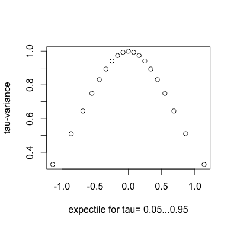
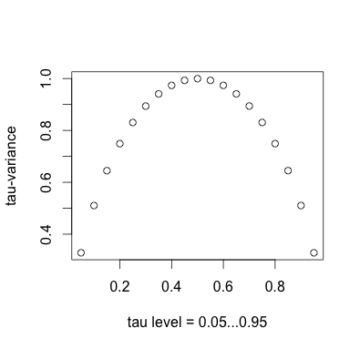
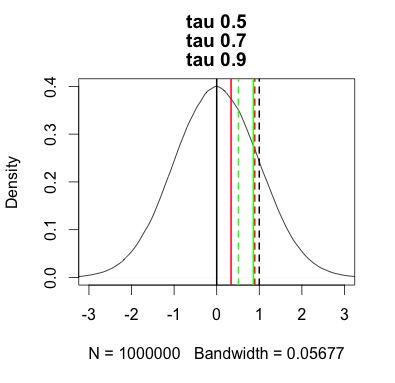

[](http://quantlet.de/index.php?p=info)

## [](http://quantlet.de/) **tau_variance** [](http://quantlet.de/d3/ia)

```yaml

Name of Quantlet : tau_variance

Published in : 'Tran N., Osipenko M., Härdle W. (2014): Principal Component Analysis in Asymmetric
Norm'

Description : 'Simulate the data from standard normal distribution and compute the tau-variance.
Plot the tau-variance for different levels of tau.'

Keywords : asymmetric norm, expectile, quantile, tau, variance, pca

Author : Burdejova P.

Submitted : 20160607 by Burdejova P.

```








### R Code:
```r
# install and load packages
libraries = c("expectreg")
lapply(libraries, function(x) if (!(x %in% installed.packages())) {
    install.packages(x)
})
lapply(libraries, library, quietly = TRUE, character.only = TRUE)

# tau-variance function
var_tau <- function(y, tau) {
    e_tau = expectile(y, probs = tau)
    wgt_mtx = ((1 - tau) * (y <= e_tau)) + (tau * (y > e_tau))
    nf = length(y)
    return(sum(wgt_mtx * (y - e_tau) * (y - e_tau))/nf)
}

# generate data
mu = 0
sigma = 1
n_obs = 10^6
y = rnorm(n_obs, mu, sigma)


# ------------ Figure: all tau: expetile vs. variance
# --------------------------------------------------------

# define tau_list of shown tau
tau_list2 = c(1:19)/20

# prepare list for output
e_result_list2 = rep(0, length(tau_list2))
q_result_list2 = rep(0, length(tau_list2))
var_result_list2 = rep(0, length(tau_list2))

# compute
for (tau in tau_list2) {
    cat("computing tau=", tau, "\n")
    e = expectile(y, probs = tau)
    q = quantile(y, probs = tau)
    var_e = var_tau(y, tau = tau)
    # save output
    i = which(tau_list2 == tau)
    e_result_list2[i] = e
    q_result_list2[i] = q
    var_result_list2[i] = var_e
} 

# ------------ Figure: expectile vs. tau-variance
# --------------------------------------------------------
every_second = c(1:19)%%2 == 0  #index to plot every second observation
plot(e_result_list2[every_second], 2 * var_result_list2[every_second], 
	xlab = "expectile for tau= 0.05...0.95", ylab = "tau-variance")

# plot(e_result_list2, 2 * var_result_list2, 
#	xlab = 'expectile for tau= 0.05...0.95', ylab = 'tau-variance')
 
 
# ------------ Figure: tau level vs. tau variance
# --------------------------------------------------------

plot(tau_list2, 2 * var_result_list2, xlab = "tau level = 0.05...0.95",
	ylab = "tau-variance")


# ------------ Figure: density and selected tau-measures
# -------------------------------------------------------- 

#define tau_list of shown tau
tau_list = c(5, 7, 9)/10
color    = c("black", "red", "green", "blue")

# plot density
plot(density(y), main = paste0("tau ", tau_list), xlim = c(-3, 3))

# take output from previous computation for given tau_list
e_result_list   = e_result_list2[which(tau_list2 %in% tau_list)]
var_result_list = var_result_list2[which(tau_list2 %in% tau_list)]

# mutliplication
c = 2
var_result_list = c * var_result_list

# plot lines
for (i in 1:length(tau_list)) {
    # e = expectile(y, probs = tau) var_e = var_tau(y, tau = tau) plot lines
    abline(v = e_result_list[i], lwd = 2, col = color[i])
    abline(v = var_result_list[i], lwd = 2, lty = 2, col = color[i])
}


# ------------ Figure: density and selected tau-measures - ZOOMED
# -------------------------------------------------------- 

# plot density
plot(density(y), main = paste0("tau ", tau_list), xlim = c(-0.5, 1.5))

# plot lines
for (i in 1:length(tau_list)) {
    # e = expectile(y, probs = tau) var_e = var_tau(y, tau = tau) plot lines
    abline(v = e_result_list[i], lwd = 2, col = color[i])
    abline(v = var_result_list[i], lwd = 2, lty = 2, col = color[i])
}
```
